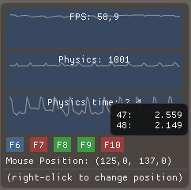
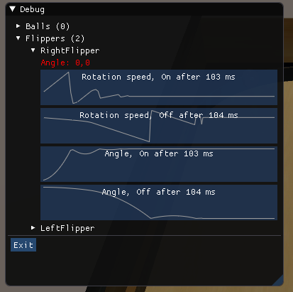
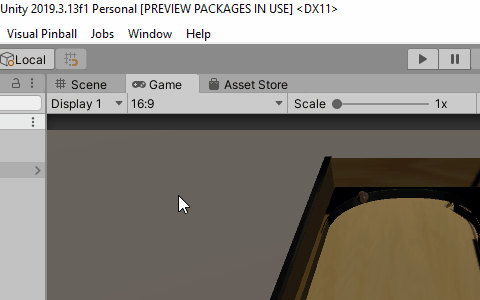
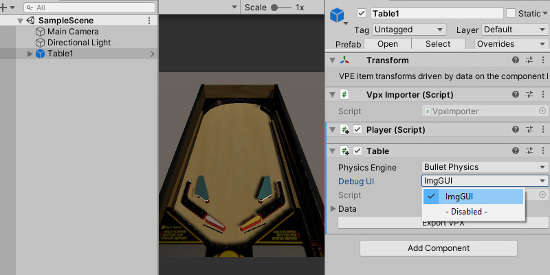

# Debug ImGUI for Visual Pinball Engine

Adds debug UI based on Dear ImGUI.
 
**Work in progress.**
## Features
- Overlay window with performance monitor

- Debug window to monitor objects

- Spawn ball at mouse cursor (**F6**)
- Ball manual roll (**F7**)
- Show/Hide debug window (**F8**)
- Show/Hide performance charts (**F9**)
- Free Cam (**F10**)
- Default VPX and Bullet Physics supported

## Instalation
1. Install Visual Pinball Engine, see: https://github.com/freezy/VisualPinball.Engine
2. Download and unzip this git repo.
3. In Unity add package same way as for VPE. 

4. Select `ImgGUI` as `Debug UI`.

## Credits
- [Dear ImGUI](https://github.com/ocornut/imgui)
- [cimgui](https://github.com/cimgui/cimgui)
- [ImGUI.NET](https://github.com/mellinoe/ImGui.NET)
- [Dear ImGui for Unity](https://github.com/realgamessoftware/dear-imgui-unity)
- [FreeCam](https://gist.github.com/ashleydavis/f025c03a9221bc840a2b)